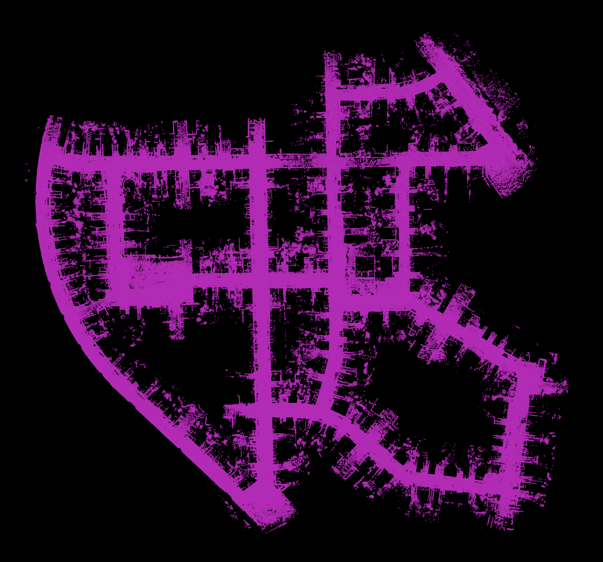
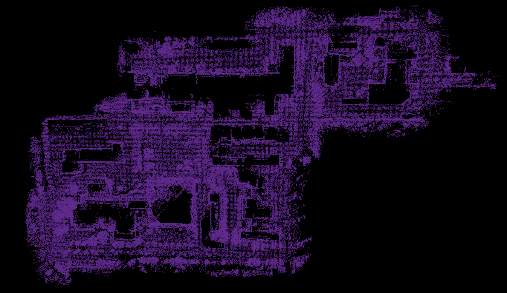
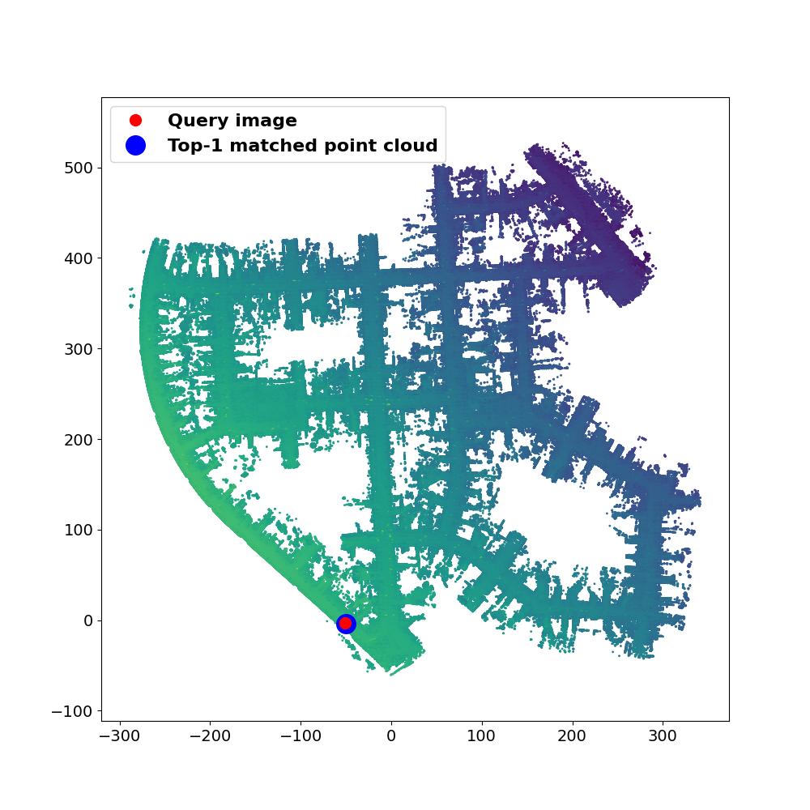
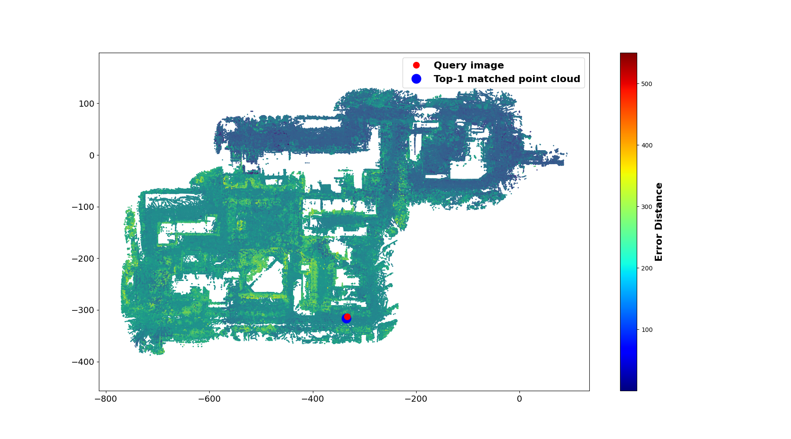
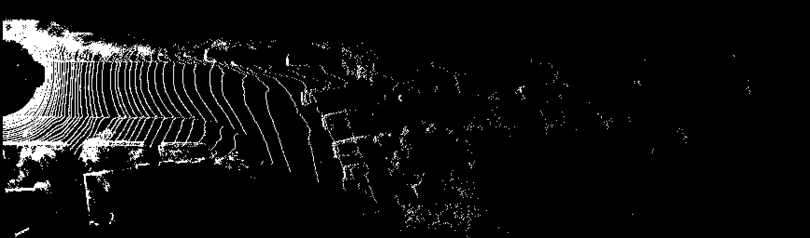

# Vis_tools
Visualization of KITTI and NCLT datasets.

# Usage
1.Merge LiDAR point clouds to a global map with known poses on KITTI odometry dataset.
```bash
cd Vis_tools
mkdir build
cd build
cmake ..
make
./merge
```
<p align="center">

</p>


2.Merge LiDAR point clouds to a global map with known poses on NCLT dataset.
```bash
python NCLT_CloudMerge.py
```
<p align="center">
  
</p>


3.Visualization of localization process on KITTI dataset.
```bash
python Vis_localization_KITTI.py
```
<p align="center">

</p>

4.Visualization of localization process on NCLT dataset.
```bash
python Vis_localization_NCLT.py
```
<p align="center">

</p>


5.Convert point cloud to on KITTI dataset.
```bash
python point_cloud2bev_KITTI.py
```
<p align="center">

</p>

